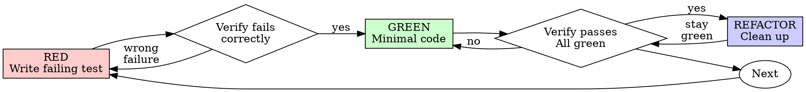

# Test-Driven Development (TDD)

## 개요

테스트를 먼저 작성한다. 실패하는 것을 확인한다. 최소한의 코드를 작성해서 통과시킨다.

**핵심 원칙:** 테스트가 실패하는 것을 직접 봤다면, 그 테스트가 올바른 것을 테스트하는지 안다.

**규칙의 형식을 어기는 것은 정신을 어기는 것이다.**

## 언제 사용하는가

**항상:**
- 새로운 기능
- 버그 수정
- 리팩토링
- 동작 변경

**예외 (인간 파트너에게 확인):**
- 일회용 프로토타입
- 생성된 코드
- 설정 파일

"이번만 TDD를 건너뛰자"고 생각하는가? 멈춰라. 그것은 합리화이다.

## 철칙

```
실패하는 테스트 없이 프로덕션 코드를 작성하지 말 것
```

테스트 전에 코드를 작성했는가? 삭제하고 다시 시작하라.

**예외 없음:**
- "참고용"으로 유지하지 말 것
- 테스트를 작성하면서 "수정"하지 말 것
- 코드를 보지도 말 것
- 삭제는 삭제다

테스트에서부터 처음부터 구현하라. 끝.

## RED-GREEN-REFACTOR



### RED - 실패하는 테스트 작성

일어나야 할 것을 보여주는 최소한의 테스트를 하나 작성하라.

<Good>
```typescript
test('retries failed operations 3 times', async () => {
  let attempts = 0;
  const operation = () => {
    attempts++;
    if (attempts < 3) throw new Error('fail');
    return 'success';
  };

  const result = await retryOperation(operation);

  expect(result).toBe('success');
  expect(attempts).toBe(3);
});
```
명확한 이름, 실제 동작 테스트, 한 가지만
</Good>

<Bad>
```typescript
test('retry works', async () => {
  const mock = jest.fn()
    .mockRejectedValueOnce(new Error())
    .mockRejectedValueOnce(new Error())
    .mockResolvedValueOnce('success');
  await retryOperation(mock);
  expect(mock).toHaveBeenCalledTimes(3);
});
```
모호한 이름, 실제 코드 대신 mock 테스트
</Bad>

**요구사항:**
- 한 가지 동작
- 명확한 이름
- 실제 코드 (mock은 불가피할 때만)

### RED 확인 - 실패하는 것을 보라

**필수. 절대 건너뛰지 말 것.**

```bash
npm test path/to/test.test.ts
```

확인:
- 테스트가 실패한다 (에러 아님)
- 실패 메시지가 예상대로다
- 기능이 빠져서 실패한다 (오타 아님)

**테스트가 통과한다?** 기존 동작을 테스트하고 있다. 테스트를 수정하라.

**테스트가 에러난다?** 에러를 수정하고, 제대로 실패할 때까지 다시 실행하라.

### GREEN - 최소 코드

테스트를 통과시키는 가장 간단한 코드를 작성하라.

<Good>
```typescript
async function retryOperation<T>(fn: () => Promise<T>): Promise<T> {
  for (let i = 0; i < 3; i++) {
    try {
      return await fn();
    } catch (e) {
      if (i === 2) throw e;
    }
  }
  throw new Error('unreachable');
}
```
통과하는 데 필요한 만큼만
</Good>

<Bad>
```typescript
async function retryOperation<T>(
  fn: () => Promise<T>,
  options?: {
    maxRetries?: number;
    backoff?: 'linear' | 'exponential';
    onRetry?: (attempt: number) => void;
  }
): Promise<T> {
  // YAGNI
}
```
과도하게 엔지니어링됨
</Bad>

기능을 추가하거나, 다른 코드를 리팩토링하거나, 테스트를 "개선"하지 말 것.

### GREEN 확인 - 통과하는 것을 보라

**필수.**

```bash
npm test path/to/test.test.ts
```

확인:
- 테스트가 통과한다
- 다른 테스트도 여전히 통과한다
- 출력이 깔끔하다 (에러, 경고 없음)

**테스트가 실패한다?** 테스트가 아니라 코드를 수정하라.

**다른 테스트가 실패한다?** 지금 수정하라.

### REFACTOR - 정리

green 상태 이후에만:
- 중복 제거
- 이름 개선
- 헬퍼 추출

테스트는 green 유지. 동작 추가하지 말 것.

### 반복

다음 기능을 위해 다음 실패 테스트로.

## 좋은 테스트

| 품질 | 좋음 | 나쁨 |
|------|------|------|
| **최소** | 한 가지. 이름에 "and"가 있으면? 분리하라. | `test('validates email and domain and whitespace')` |
| **명확** | 이름이 동작을 설명한다 | `test('test1')` |
| **의도 표현** | 원하는 API를 시연한다 | 코드가 뭘 해야 하는지 불명확함 |

## 순서가 중요한 이유

**"테스트를 나중에 작성해서 작동하는지 확인하겠다"**

테스트가 코드 후에 작성되면 즉시 통과한다. 즉시 통과는 아무것도 증명하지 않는다:
- 잘못된 것을 테스트할 수 있다
- 동작이 아닌 구현을 테스트할 수 있다
- 까먹은 엣지 케이스를 놓칠 수 있다
- 버그를 잡는 것을 본 적 없다

테스트-먼저는 테스트가 실패하는 것을 보게 강제하고, 이는 실제로 뭔가를 테스트한다는 것을 증명한다.

**"이미 모든 엣지 케이스를 수동으로 테스트했다"**

수동 테스트는 ad-hoc이다. 모든 것을 테스트했다고 생각하지만:
- 뭘 테스트했는지 기록이 없다
- 코드가 변하면 다시 실행할 수 없다
- 압박 상황에서 케이스를 잊기 쉽다
- "시도했을 때 작동했다" ≠ 완전함

자동 테스트는 체계적이다. 매번 똑같이 실행된다.

**"X 시간 작업을 삭제하는 것은 낭비다"**

매몰 비용 오류. 시간은 이미 지났다. 지금 선택:
- 삭제하고 TDD로 다시 작성 (X 더 시간, 높은 신뢰도)
- 유지하고 나중에 테스트 추가 (30분, 낮은 신뢰도, 버그 많음)

"낭비"는 신뢰할 수 없는 코드를 유지하는 것이다. 실제 테스트 없는 작동 코드는 기술 부채다.

**"TDD는 독단적이고, 실용적이라는 것은 적응하는 것이다"**

TDD는 실용적이다:
- 커밋 전 버그 찾기 (디버깅보다 빠름)
- 회귀 방지 (테스트가 손상을 즉시 잡음)
- 동작 문서화 (테스트가 코드 사용 방법 보여줌)
- 리팩토링 가능 (자유롭게 변경, 테스트가 손상 잡음)

"실용적"인 단축은 = 프로덕션 디버깅 = 느림.

**"나중에 테스트가 같은 목표를 달성한다 - 형식이 아니라 정신이다"**

아니다. 나중 테스트는 "이게 뭐 하는 거?" 답한다. 먼저 테스트는 "이게 뭘 해야 하는가?" 답한다.

나중 테스트는 구현에 편향된다. 만든 것을 테스트하지, 필요한 것을 테스트하지 않는다. 기억한 엣지 케이스를 검증하지, 발견한 것을 하지 않는다.

먼저 테스트는 구현 전에 엣지 케이스 발견을 강제한다. 나중 테스트는 기억한 모든 것을 검증한다 (안 했다).

30분 나중 테스트 ≠ TDD. 커버리지를 얻고, 테스트 작동 증명을 잃는다.

## 일반적인 합리화

| 핑계 | 현실 |
|------|------|
| "너무 간단해서 테스트할 수 없다" | 간단한 코드도 망친다. 테스트는 30초다. |
| "나중에 테스트하겠다" | 즉시 통과 테스트는 아무것도 증명하지 않는다. |
| "나중 테스트가 같은 목표를 달성한다" | 나중 테스트 = "이게 뭐 하는 거?" 먼저 테스트 = "이게 뭘 해야 하는가?" |
| "이미 수동으로 테스트했다" | Ad-hoc ≠ 체계적. 기록 없음, 다시 실행 불가. |
| "X 시간 삭제는 낭비다" | 매몰 비용 오류. 검증되지 않은 코드 유지는 기술 부채다. |
| "참고용 유지, 테스트 먼저 작성" | 적응할 것이다. 그것이 나중 테스트다. 삭제는 삭제다. |
| "먼저 탐색 필요" | 좋다. 탐색 버린다, TDD로 시작한다. |
| "테스트 어려움 = 디자인 불명확" | 테스트 들어라. 테스트 어려움 = 사용 어려움. |
| "TDD가 느려질 것" | TDD가 디버깅보다 빠르다. 실용적 = 테스트-먼저. |
| "수동 테스트가 빠르다" | 수동은 엣지 케이스 증명 안 한다. 모든 변경마다 다시 테스트한다. |
| "기존 코드는 테스트 없다" | 개선하고 있다. 기존 코드에 테스트 추가하라. |

## 빨간 깃발 - STOP하고 다시 시작하라

- 테스트 전 코드
- 구현 후 테스트
- 즉시 통과 테스트
- 테스트 실패 이유 설명 불가
- "나중에" 추가된 테스트
- "이번만" 합리화하기
- "이미 수동으로 테스트했다"
- "나중 테스트가 같은 목적이다"
- "정신이지 형식이 아니다"
- "참고용 유지" 또는 "기존 코드 수정"
- "이미 X 시간 썼으니 삭제는 낭비다"
- "TDD는 독단적, 나 실용적"
- "이건 다르다..."

**이 모든 것은: 코드 삭제. TDD로 다시 시작.**

## 예시: 버그 수정

**버그:** 빈 이메일 허용됨

**RED**
```typescript
test('rejects empty email', async () => {
  const result = await submitForm({ email: '' });
  expect(result.error).toBe('Email required');
});
```

**RED 확인**
```bash
$ npm test
FAIL: expected 'Email required', got undefined
```

**GREEN**
```typescript
function submitForm(data: FormData) {
  if (!data.email?.trim()) {
    return { error: 'Email required' };
  }
  // ...
}
```

**GREEN 확인**
```bash
$ npm test
PASS
```

**REFACTOR**
필요하면 여러 필드 검증 추출.

## 검증 체크리스트

작업 완료 전:

- [ ] 모든 새 함수/메서드에 테스트가 있다
- [ ] 각 테스트 실패를 구현 전에 봤다
- [ ] 각 테스트가 예상된 이유로 실패했다 (기능 누락, 오타 아님)
- [ ] 각 테스트 통과를 위해 최소 코드를 작성했다
- [ ] 모든 테스트 통과
- [ ] 출력이 깔끔하다 (에러, 경고 없음)
- [ ] 테스트가 실제 코드를 사용한다 (mock은 불가피할 때만)
- [ ] 엣지 케이스와 에러 커버됨

모든 상자를 체크 못했는가? TDD를 건너뛰었다. 다시 시작하라.

## 막혔을 때

| 문제 | 해결 |
|------|------|
| 테스트 방법 모름 | 원하는 API 작성. 먼저 assertion 작성. 인간 파트너에 물어보기. |
| 테스트 너무 복잡 | 디자인 너무 복잡. 인터페이스 단순화. |
| 모든 것을 mock해야 함 | 코드 너무 결합. 의존성 주입 사용. |
| 테스트 셋업 거대함 | 헬퍼 추출. 여전히 복잡? 디자인 단순화. |

## 디버깅 통합

버그 발견? 재현하는 실패 테스트 작성. TDD 사이클 따르기. 테스트가 수정을 증명하고 회귀 방지한다.

버그 수정은 절대 테스트 없이 하지 말 것.

## 테스트 안티-패턴

Mock이나 테스트 유틸리티 추가할 때, @testing-anti-patterns.md 읽어서 일반적 함정 피하라:
- Mock 동작 대신 실제 동작 테스트
- 프로덕션 클래스에 테스트-전용 메서드 추가
- 의존성 이해 없이 Mocking

## 최종 규칙

```
프로덕션 코드 → 테스트 존재하고 먼저 실패함
아니면 → TDD 아님
```

인간 파트너 허락 없이 예외 없음.
